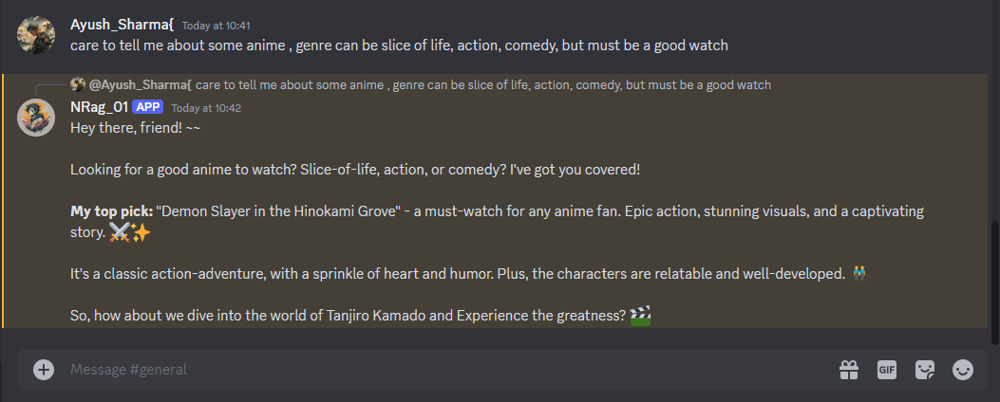
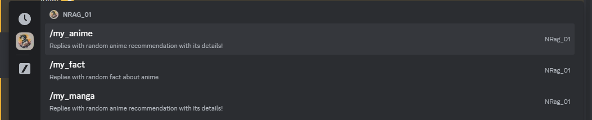

<h1 align="center" >NRag - AI Discord Chatbot</h1>
<br>

<br>
      

## Discord Bot Creation and Installation :         
---
1. Create a new server in your discord.         
2. Now go to discord settings -> Advanced -> Toggle ON the Developer Mode.          
3. Go to [Discord Developer Portal](https://discord.com/developers/applications).          
4. Create a new Application -> Give it a name.        
5. Go to ` Bot ` under Settings, copy and note ` Bot Token ` and then scroll down toggle ON the ` MESSAGE CONTENT INTENT `.
6. Now go to OAuth2 , copy and note ` Client ID ` , scroll down in ` OAuth2 URL GENERATOR ` click on ` bot `, then give your bot permissions ` Administrator ` .     
    Note: You can specify the following permissions if you do not want to give your bot Administrator permissions:           
    1. ` Send Messages `       
    2. ` Manage Messages `      
    3. ` Send Messages in Threads `      
    4. ` Read Message History `         
    5. ` Mention Everyone `         
    6. ` Use External Emojis `          
    7. ` Add Reactions `         
    8. ` Use Slash Commmands `       
7. Copy the url generated and paste in a new browser window, add your bot to the server you want.    
8. And once this is done, your bot is created and now installed in your desired server.         

## Discord Bot Server Setup :    
---
1. Fork this repo, git clone it in your directory in local machine.     
2. Copy the contents of ` .env.example ` file and create a new ` .env ` file and paste in it. Fill the tokens obtained in point [5] and [6].     
3. As for AI_API_KEY, visit [https://mdb.ai/](https://mdb.ai/) , and signup and copy/note your mindsdb api key.       
4. Now open terminal in that directory, and run these commands in order:         
```sh
cd nrag-ai_discord-chatbot
npm i
node commands.js
npm start
```         
5. Now your server is up and running, you should able to interact with your discord bot.      

## Tech stack used :    
1. Nodejs for server creation, and runtime.           
2. Discord.js for configuring discord bot workings and server. Visit [https://discord.js.org/docs/packages/discord.js/14.15.3](https://discord.js.org/docs/packages/discord.js/14.15.3) and [https://discordjs.guide/popular-topics/intents.html#privileged-intents](https://discordjs.guide/popular-topics/intents.html#privileged-intents) for more information.     

    